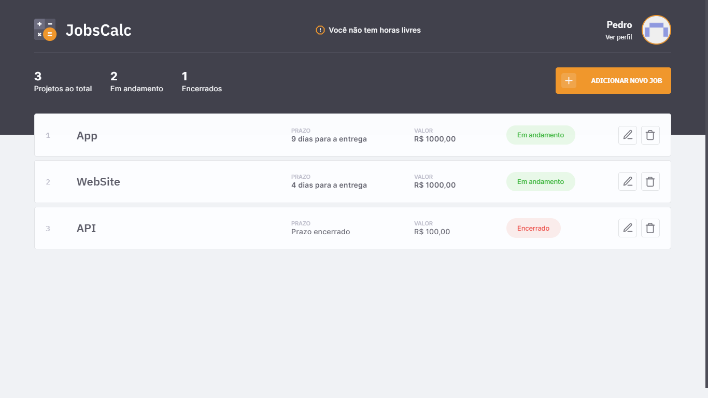

<p align="center">
  
</p>

<h1 align="center">
  
</h1>

## 🧪 Tecnologias

Esse projeto foi desenvolvido com as seguintes tecnologias:

- HTML
- CSS
- JavaScript
- EJS
- NodeJS
- Express
- Sqlite

## 🚀 Como executar

Para iniciar o projeto, siga os passos abaixo:

```bash
# Instalar as dependências (Npm ou Yarn)
$ yarn || npm install

# Iniciar o projeto (Npm ou Yarn)
$ yarn dev || npm run dev
```

O projeto estará disponível no seu browser pelo endereço http://localhost:3000.

O banco de dados já está configurado, e se encontra na raiz do projeto no arquivo <b>database.sqlite</b>

## 💻 Projeto

JobsCalc é um lugar pra pessoa que faz freelancer, organizar os seus projetos. Organizando quantas horas você quer trabalhar por dia, quanto quer receber por mês e prazo para entrega de cada projeto.

- Design Responsivo
- Projetos salvos em banco de dados
- Dados atualizados dinamicamente
- Ajusta altomaticamento o status do projeto, baseado nas horas restantes.

## 📝 License

Esse projeto está sob a licença MIT. Veja o arquivo [LICENSE](LICENSE) para mais detalhes.

---

Feito com ❤ by [Pedro Leonardo](https://github.com/xpedroleonardo)
